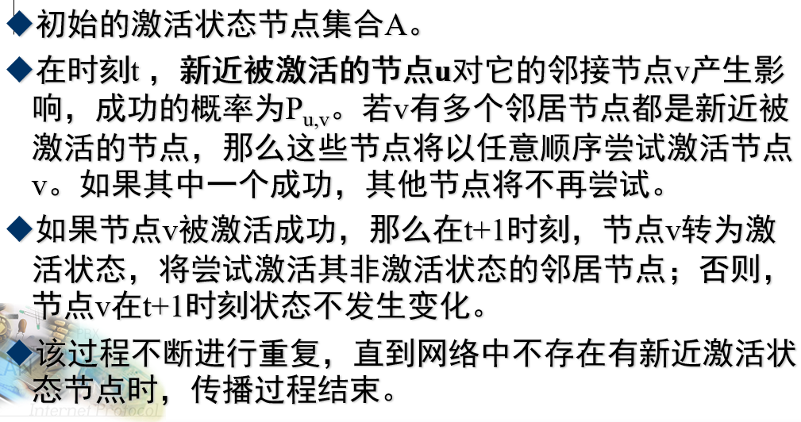
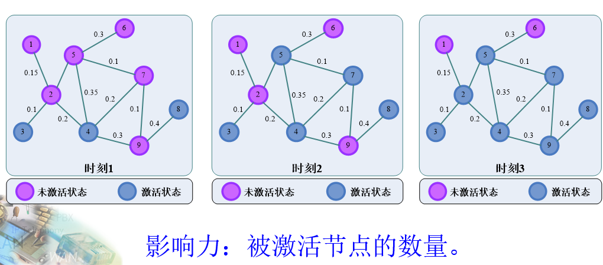
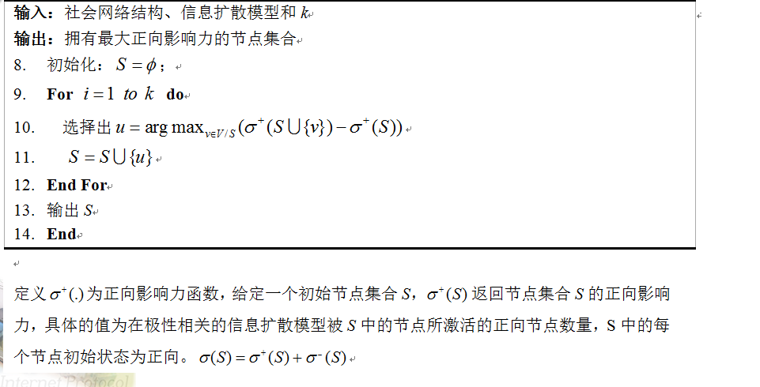
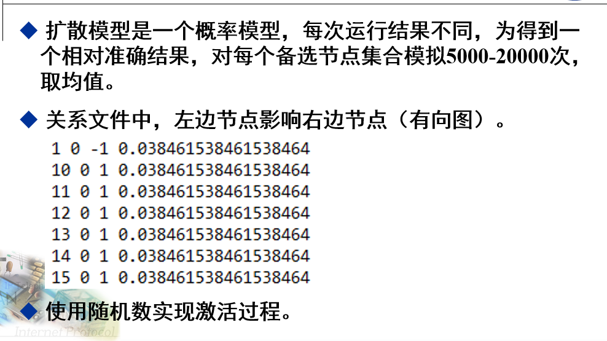
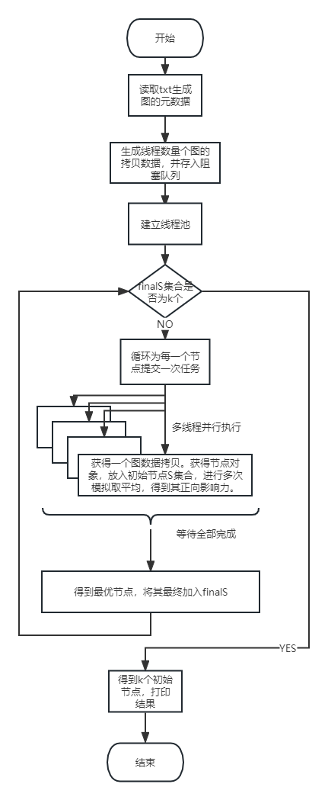

# 问题描述
## 前言
这是一个java程序实现的关于图的算法题。为了优化性能，本程序主要采用了如下技术：  
多线程、锁、线程池、CountdownLatch、阻塞队列、ThreadLocal、深拷贝、多种集合类以及其性能上的考虑。  
欢迎java多线程初学者学习、练习我的这个项目，**代码中注释非常详细！**。  
项目大概花费一周时间完成。
### 通俗描述：
这是一个图数据，图中每个节点都可以以一定概率激活相邻节点。  
时刻从0开始，每个时刻中，只有上一个时刻新被激活的节点才有激活能力。  
选择k个初始节点不断激活其他节点，直到所有节点都被激活或者上一个时刻没有新激活的节点。  
问选择哪k个初始节点，能使被激活的节点总数最多，即正向影响力最大？  
### 详细介绍

正向影响力：概率为正的情况下被激活。

有两个txt文件存图数据，alluserlist.txt存所有节点id，links.txt存节点之间连接关系：

# 算法解释
本题采用给定的贪心策略，即每次在之前选择的基础上，选择1个最优节点，这个节点能够使正向影响力的提升最大。  
选择k次即可得出k个初始节点。即每次都选择一个最优节点放入初始节点集合中。  
当然，选择要多次模拟取平均。

# 本人大致思路
* 先定义两个实体类，一个是节点类Node，一个是节点之间联系关系类ConnectedRelation，通过读取txt文件来实例化这两个类，并存入list列表中。  
* 定义模拟类Simulation，在这个类里，可以把图数据按一定次数模拟激活过程，并返回平均值。
* 这样已经可以实现本程序的功能了，但这样是串行执行，由于节点数量多、模拟次数大、导致耗时较久。因此可以使用多线程并行模拟。
* 引入多线程带来的问题：多个线程模拟时，不能使用同一份图数据，因为这是线程不安全的。所以应该每个线程都使用图数据的拷贝，而且是深拷贝
* 难道每次模拟前，都去拷贝一份数据吗？这样太耗时了。我使用了一个阻塞队列，在初始化时就存一定量的拷贝，让每个线程模拟前去队列中取，用完了再放回去。
* 为了进一步优化性能，还有许多细节需要注意。
本程序流程图如下

# 性能提升点
1. **集合的选取**：对于怎么存储节点集合，使用ArrayList存储。原因：因为读取txt文件时，要不断向list中插入新数据，如果使用LinkedList，则还要**浪费寻址时间，且只在队尾插入**，故使用ArrayList性能最高。  
且要**指定初始容量，减少扩容次数**。  
如果使用LinkedList，则绝不可以使用get，而是要使用iterator迭代。因为其是链表实现。
2. **怎么根据id查找node**：在多个线程进行模拟时，使用一个List保存确定的初始节点。这肯定不能存node对象，因为有好几份图数据。因此存节点的id。此外，读取links.txt文件时，每一行前两个数代表左右节点的id。
因此，需要一个通过id找node对象的方法。当然可以遍历list，if（node.id == id）return node；。但这样是很慢的。因此使用Hashmap建立id与node对象的联系，大大加快查找速度。
3. **怎么建立list和map绑定关系**：因此每一份图拷贝，都要生成对应的map拷贝。那么问题来了，当一个线程获得了一个图拷贝时，怎么获得对应的map拷贝呢。当然，最简单的方法是使用一个map把这两个对象绑定在一起然后把map存入阻塞队列。但这样对调用方是不方便的  
因此我使用了ThreadLocal存储每个线程所需要的map拷贝。在取图拷贝的时候，就把map拷贝存到ThreadLocal里，当然，归还图拷贝时再remove掉（规范）。对于调用方来说，这些操作都是透明的。  
只需调用List<Node> getNodeListCopy()、void returnNodeListCopy(List<Node> nodeList)两个方法即可。  
**记录一个坑**：一开始我没用ThreadLocal，而是又建了一个map，建立list和map的连接关系。但这样会出现一个非常严重的问题，那就是list很大，这是一个**大key，因此put get时调用hashCode方法非常耗时！**

# 细节注意点
1. **深拷贝**：初始化时，读取txt文件生成图数据的元数据。然后拷贝图数据放入阻塞队列中，注意拷贝一定要深拷贝。相对于序列化拷贝，我选择了遍历然后new的方式拷贝。
2. **防int溢出**：对于每一个时刻的多次模拟计算平均值，不能先把每次模拟得到的影响力求和，然后除以次数，这样可能造成溢出。而是每次都除以次数，最后再求和。
3. **线程数量**：对于CPU密集型任务，线程数不要超过cpu核心数，否则效率可能降低。
4. **为什么使用阻塞队列**：对于这个题目，普通队列也不会出错，因为线程和拷贝数量相同。但如果后续增加某个方法也取了一个拷贝。则会报错。因此对于多线程，还是使用juc类比较稳妥。
5. **怎么模拟多次** 模拟使用同一个图数据副本即可，但每次模拟完，需要把数据格式化一下，即把所有的节点都设置为未激活状态。这比再拷贝一次快得多。
6. **怎么实现概率**，使用Random类获得一个概率。如果这个概率小于节点的激活概率，则判为激活成功。**注意小数的比较用BigDecimal的compareTo方法**。否则会有误差。
7. **注意主线程等待所有线程模拟完毕** ：为了等待所有的线程都模拟完之后，主线程再打印结果，这里使用了countdownLatch进行同步。
8. **注意线程安全问题**：对于总体的贪心策略，对于每次新增一个初始节点，都要遍历所有的节点，得出最优的节点。这里需要判断最优，即最大正向影响力。  
由于在线程池中，判断最大值需要加锁，即                    
synchronized (Main.class) {
   if (count > maxCount) {
   bestNode = node;
   maxCount = count;
   }
   }
